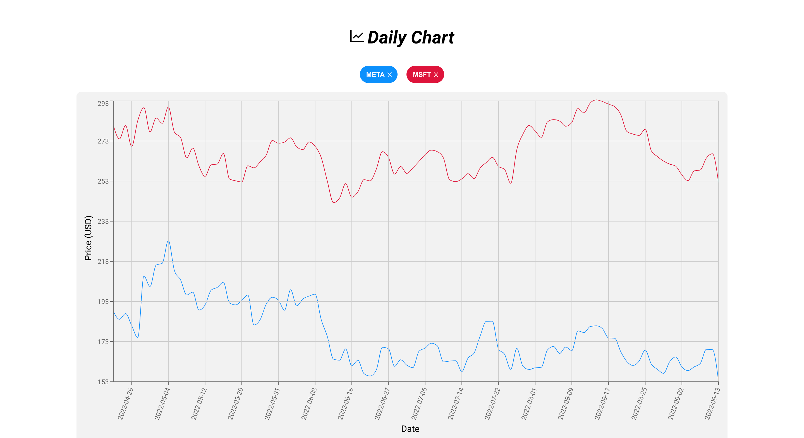
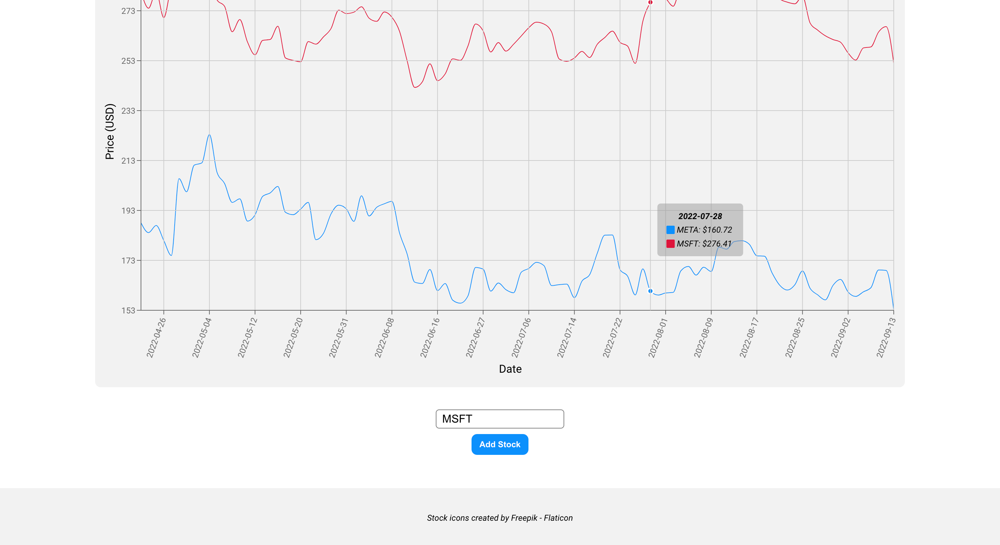

## Stock Market App

An application that allows the user to add stocks to a real-time chart shared amongst all users built with MongoDB, Express, React, Node, Javascript, and CSS.

## Screen Shots(s)

## Installation and Setup Instructions

Clone this repository (You will need `node` and `npm` installed globally on your machine)

Installation:

`npm install` 
`cd client` 
`npm install` 
`cd ..`

Set Environment Variables:

`touch config.env` 
`(Set variables "ATLAS_URI" and "ALPHA_VANTAGE_KEY" in file)`

To Start Server:

`npm start`

To Start Client:

`(Open new console tab)` 
`cd client` 
`npm start`

To Visit App:

`localhost:3000`

## Summary

- Application features:
  - Add stocks to a chart to view and compare daily price-action
  - Chart updates in real-time for all users
    - Limited by the API free-tier (5 requests/min, 500 requests/day)
- What was the purpose of this project?
  - Practicing full-stack development using React for the frontend, Node and Express for the backend, and MongoDB for the database
  - Implementing a basic real-time app using sockets